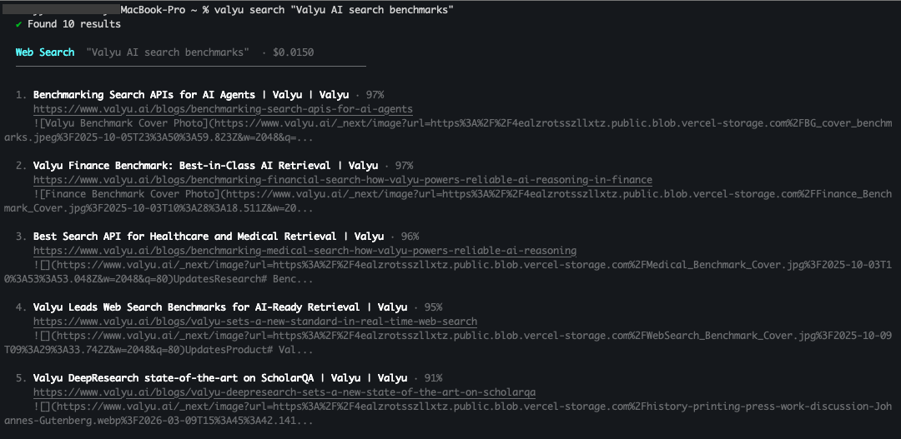

# Valyu CLI

The official CLI for [Valyu](https://valyu.ai).

Built for AI (or human) knowledge workers.

```
  ██╗   ██╗ █████╗ ██╗  ██╗   ██╗██╗   ██╗
  ██║   ██║██╔══██╗██║  ╚██╗ ██╔╝██║   ██║
  ██║   ██║███████║██║   ╚████╔╝ ██║   ██║
  ╚██╗ ██╔╝██╔══██║██║    ╚██╔╝  ██║   ██║
   ╚████╔╝ ██║  ██║███████╗██║   ╚██████╔╝
    ╚═══╝  ╚═╝  ╚═╝╚══════╝╚═╝    ╚═════╝
```

## Install

```bash
npm install -g @valyu/cli
valyu login
```

Get your API key at [platform.valyu.ai](https://platform.valyu.ai).

```bash
valyu search "CRISPR base editing latest breakthroughs"
valyu answer "What drove Tesla's Q4 2024 earnings miss?"
valyu sources --category markets
```



---

## Commands

### `valyu search`

Search across web, academic, and proprietary data sources.

```bash
# Web search (default)
valyu search "AI infrastructure investment 2025"

# Specify a source type
valyu search paper "transformer attention mechanisms"
valyu search finance "Apple AAPL earnings Q1 2026"
valyu search bio "CAR-T cell therapy phase 3 trials"
valyu search sec "Tesla 10-K 2024 risk factors"
valyu search patent "mRNA delivery lipid nanoparticles"
valyu search economics "US CPI inflation January 2025"
valyu search news "Fed interest rate decision"

# Options
valyu search paper "CRISPR" -n 20          # more results
valyu search finance "MSFT" --json         # pipe-friendly JSON
```

### `valyu answer`

Get an AI-synthesized answer from real-time search results. Streams by default.

```bash
valyu answer "What is the current state of nuclear fusion commercialisation?"
valyu answer "Summarise NVIDIA's competitive position in AI chips" --fast
```

### `valyu contents`

Extract clean content from any URL — articles, PDFs, financial reports.

```bash
valyu contents https://example.com/report
valyu contents https://sec.gov/filing --summary
valyu contents https://arxiv.org/abs/2501.00001 --summary "extract methodology and results"
```

### `valyu deepresearch`

Async deep research — produces a full report, like a junior analyst.

```bash
# Start a research task
valyu deepresearch create "Global AI compute infrastructure trends 2025"

# Start and wait for completion
valyu deepresearch create "CRISPR therapeutics market landscape" --mode heavy --watch

# Check on a running task
valyu deepresearch status <task-id>

# Poll until done
valyu deepresearch watch <task-id>
```

Research modes:

| Mode       | Time       | Use for                          |
|------------|------------|----------------------------------|
| `fast`     | ~5 min     | Quick lookups, simple questions  |
| `standard` | ~10-20 min | Balanced research (default)      |
| `heavy`    | ~60 min    | In-depth analysis, long reports  |
| `max`      | ~90 min    | Maximum depth and quality        |

### `valyu sources`

Browse all available data sources with pricing.

```bash
valyu sources                          # all 36+ sources
valyu sources --category markets       # financial data only
valyu sources --category research      # academic sources
```

### Other commands

```bash
valyu login              # save API key
valyu logout             # remove saved key
valyu whoami             # show active key and profile
valyu doctor             # check setup and connectivity
valyu open               # open platform, docs, or API keys in browser
```

---

## Flags

| Flag | Description |
|------|-------------|
| `--api-key <key>` | Override stored key for one request |
| `--json` | Force JSON output (for scripting/pipes) |
| `-q, --quiet` | No spinners, just JSON (implies `--json`) |
| `-p, --profile <name>` | Use a named credential profile |

---

## Scripting and agents

Every command outputs clean JSON with `--json` or in non-TTY contexts:

```bash
# Pipe into jq
valyu search finance "AAPL" --json | jq '.results[].title'

# In CI/CD
RESULTS=$(valyu answer "latest rate decision" --quiet)

# With environment variable
VALYU_API_KEY=your_key valyu search web "query" --json
```

### Multiple profiles

```bash
valyu login --profile work
valyu login --profile personal
valyu search web "query" --profile work
```

---

## Agent skill (Claude Code / AI agents)

The CLI ships with a SKILL.md file that teaches AI agents how to use it — no MCP server needed, 4-32x cheaper in tokens.

In Claude Code:

```
npx skills add @valyu/cli
```

Then agents can call:

```
Valyu(search, "CRISPR base editing")
Valyu(answer, "What drove NVDA earnings?")
Valyu(contents, "https://example.com")
```

---

## Data sources

36+ proprietary and public data sources across:

- **Web** - real-time web search
- **Academic** - arXiv, PubMed, bioRxiv, medRxiv
- **Financial** - stocks, earnings, balance sheets, cash flows, crypto, forex
- **SEC** - 10-K, 10-Q, 8-K filings full text
- **Patents** - global patent databases
- **Biomedical** - clinical trials, FDA drug labels, ChEMBL, DrugBank
- **Economic** - BLS, FRED, World Bank, USASpending

See all: `valyu sources`

---

## Links

- [Platform](https://platform.valyu.ai) — manage keys, usage, billing
- [Docs](https://docs.valyu.ai) — API reference
- [npm](https://www.npmjs.com/package/@valyu/cli)

---

## License

MIT
